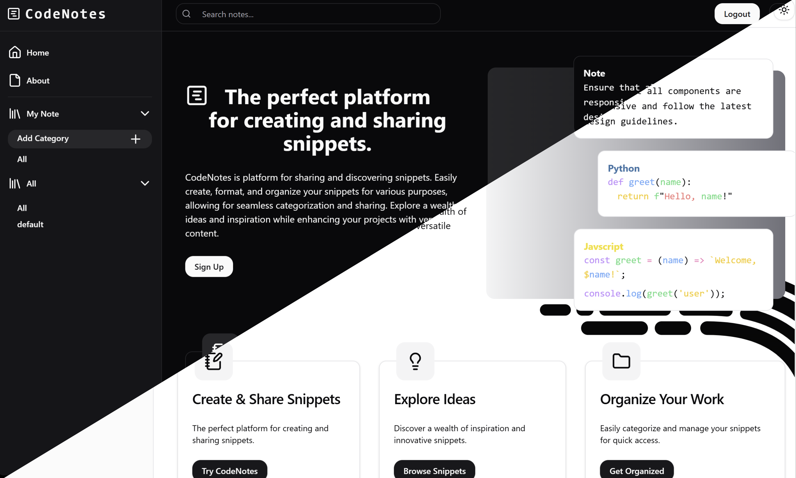
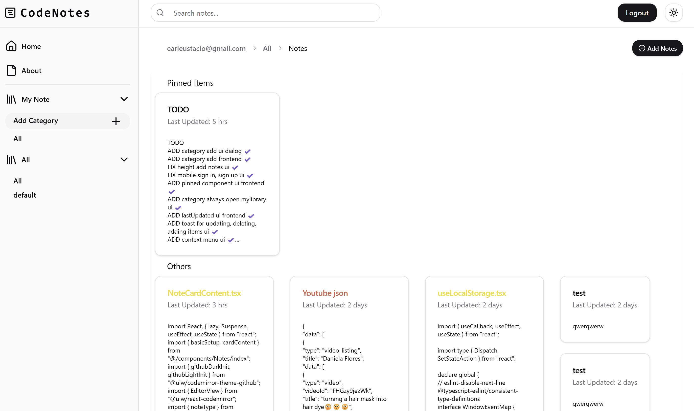

# CodeNotes - https://earleustacio.me

CodeNotes is platform for sharing and discovering snippets. Easily create, format, and organize your snippets for various purposes.


## Features

- **Light/Dark Mode**: Toggle between light and dark themes.
- **Markdown Preview**: Live preview for Markdown content.
- **Code Formatting**: Support for 50+ programming languages with syntax highlighting.
- **Embed Media**: Embed images, videos, and other media in notes.
- **CRUD Operations**: Create, read, update, and delete notes.
- **User Authentication**: Secure login and registration.
- **Pin Notes**: Pin important notes to the top for easy access.
- **Syntax Highlighting**: Auto-highlight for code blocks.
- **Categorize Notes**: Organize notes by custom categories.
- **Explore Notes**: View other users' public notes.
- **Responsive Design**: Optimized for all devices (mobile, tablet, desktop).
## Tech Stack

### Client-Side

- **React**: A powerful JavaScript library for building user interfaces, enabling a component-based architecture.
- **Vite**: A modern build tool that provides fast development and optimized production builds for React.
- **shadCN**: A utility for building flexible and accessible user interfaces in React with a component library and styling.
- **TanStack Query**: A data-fetching and state management library that simplifies fetching, caching, and synchronization of server data.
- **React Router**: A routing library for managing navigation and rendering of different views in the application.
- **TailwindCSS**: A utility-first CSS framework for rapidly building custom designs without writing custom styles.

### Server-Side

- **Flask**: A lightweight and flexible Python web framework used for building web applications and APIs.
- **SQLite**: A self-contained, serverless, and zero-configuration SQL database engine used for data storage.
- **Waitress**: A production-quality WSGI server for running Python web applications.

### Other Technologies

- **Firebase Authentication**: A backend service for user authentication, including secure login and registration features.
- **Nginx**: A high-performance web server and reverse proxy used to serve the application and handle incoming traffic.
- **Docker**: A containerization platform for creating, deploying, and running applications in isolated environments for easier development, testing, and deployment.


## Installation and Setup

### Prerequisites
- Node.js
- Python
- Docker

### Steps

1. Clone the repository:                       
```bash
git clone https://github.com/EEarlll/CodeNotes.git
```
2. Create .env Files 
Navigate to the client and server folders and create .env files:
```bash
cd client && touch .env && cd ../server/flaskr && touch .env
```
3. Configure Firebase Authentication
* Obtain the necessary Firebase credentials for authentication.
* Use the utils.py script to generate the `.env` file from your `service.json` file.
4. Start the Application Using Docker
From the base directory, bring up the containers with Docker Compose:
``` bash
docker compose up
```
5. Access the app in your browser at `http://localhost`.

## API Reference

### Get Notes

```http
GET /api/Notes
```

| Parameter   | Type     | Description                                                  |
| :---------- | :------- | :----------------------------------------------------------- |
| `offset`    | `string` | Optional. Pagination offset (default: 0).                    |
| `limit`     | `string` | Optional. Number of notes to retrieve (default: 25).         |
| `search`    | `string` | Optional. Search term to filter notes by title.              |
| `category`  | `string` | Optional. Category to filter notes (via route parameters).   |
| `user`      | `string` | Optional. User to filter notes (via route parameters).       |

---

### Get Categories

```http
GET /api/Notes/categorylist/
GET /api/Notes/categorylist/${user}
```

| Parameter | Type     | Description                            |
| :-------- | :------- | :------------------------------------- |
| `user`    | `string` | Optional. User to filter categories.   |

---

### Get Pinned Notes

```http
GET /api/Notes/pinnedNotes/
```

| Parameter | Type     | Description                                |
| :-------- | :------- | :----------------------------------------- |
| `uid`     | `string` | **Required**. User ID from the request.    |

---

### Pin a Note

```http
POST /api/Notes/${id}/pin
```

| Parameter | Type     | Description                                |
| :-------- | :------- | :----------------------------------------- |
| `id`      | `integer`| **Required**. ID of the note to pin.       |

**Request Body:**
```json
{
  "user": "user_identifier"
}
```

---

### Unpin a Note

```http
DELETE /api/Notes/${id}/pin
```

| Parameter | Type     | Description                                |
| :-------- | :------- | :----------------------------------------- |
| `id`      | `integer`| **Required**. ID of the note to unpin.     |

---

### Create a Note

```http
POST /api/Notes/create
```

| Parameter   | Type     | Description                                           |
| :---------- | :------- | :---------------------------------------------------- |
| `title`     | `string` | **Required**. Title of the note.                      |
| `user`      | `string` | **Required**. User identifier.                        |
| `category`  | `string` | **Required**. Category to assign the note.            |
| `message`   | `string` | **Required**. Content of the note.                    |
| `format`    | `string` | **Required**. Format of the note (e.g., "text/html"). |

**Request Body:**
```json
{
  "title": "My Note Title",
  "user": "user123",
  "category": "Work",
  "message": "This is the content of the note.",
  "format": "text"
}
```

---

### Update a Note

```http
POST /api/Notes/${id}/update
PUT /api/Notes/${id}/update
```

| Parameter | Type     | Description                          |
| :-------- | :------- | :----------------------------------- |
| `id`      | `integer`| **Required**. ID of the note to update.|

**Request Body:**
```json
{
  "title": "Updated Title",
  "message": "Updated content"
}
```

---

### Delete a Note

```http
DELETE /api/Notes/${id}/delete/
DELETE /api/Notes/${id}/delete/${category}
```

| Parameter  | Type     | Description                           |
| :--------- | :------- | :------------------------------------ |
| `id`       | `integer`| **Required**. ID of the note to delete. |
| `category` | `string` | Optional. Category to delete.         |

---

### Create a Category

```http
POST /api/Notes/create/category/${category}
```

| Parameter  | Type     | Description                           |
| :--------- | :------- | :------------------------------------ |
| `category` | `string` | **Required**. Name of the category.   |

**Request Body:**
```json
{
  "user": "user123"
}
```

---

### Delete a Category

```http
DELETE /api/Notes/${id}/delete/${category}
```

| Parameter  | Type     | Description                           |
| :--------- | :------- | :------------------------------------ |
| `category` | `string` | **Required**. Name of the category to delete. |

--- 

## Screenshots



## Live Demo
Check out the live project: [Site Url](https://earleustacio.me)

---

## Contributing
Contribute to the project by doing the following: 
1. Fork the repository.
2. Create a feature branch:
```bash
git checkout -b feature/your-feature-name
   ```
3. Commit your changes:
   ```bash
   git commit -m "Add your message"
   ```
4. Push to the branch:
   ```bash
   git push origin feature/your-feature-name
   ```
5. Create a pull request.

---

## License
This project is licensed under the [MIT License](LICENSE).
---


